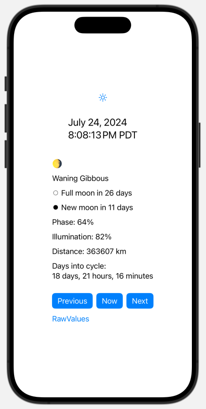

# Tiny Moon demo app

iOS app to showcase how to use [Tiny Moon Swift Package](https://github.com/mannylopez/TinyMoon)

[Tiny Moon Swift Package](https://github.com/mannylopez/TinyMoon) is a tiny library to calculate the moon phase for any given date, works super fast, and works completely offline.

The code in this repo builds the following view:

